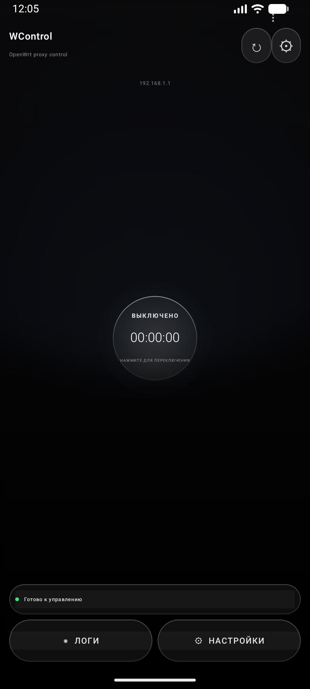
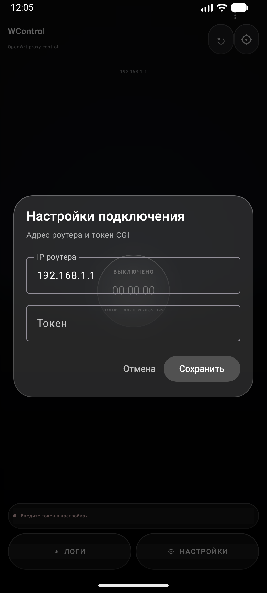

# WControl

[](https://developer.android.com)
[](https://kotlinlang.org)
[](https://developer.android.com/jetpack/compose)
[](https://openwrt.org)
[](LICENSE)

<p align="center">
  <b>🇷🇺 Русский</b> · <a href="#-english">🇬🇧 English</a>
</p>

---

> Android-приложение для включения и выключения прокси-службы на роутере **OpenWrt** через локальный CGI-эндпоинт.  
> Приложение **не настраивает** прокси, Podkop или AmneziaWG самостоятельно: оно вызывает скрипт на роутере, а скрипт уже управляет выбранной службой.

<p align="center">
  🎛 <b>Одна кнопка — включить/выключить прокси на OpenWrt.</b><br>
  <sub>Jetpack Compose · тёмный Liquid Glass UI · универсальные on/off-скрипты для Podkop, Passwall, OpenClash, Sing-box и Xray</sub>
</p>

---

## 📸 Скриншоты

<p align="center">
  
  
</p>

## 🔎 Ключевые слова

`openwrt` · `android` · `kotlin` · `jetpack-compose` · `proxy` · `router` · `home-network` · `vpn` · `podkop` · `passwall` · `openclash` · `sing-box` · `xray` · `cgi` · `amneziawg`

## 📑 Содержание

- [✨ Возможности](#-возможности)
- [🔧 Как это работает](#-как-это-работает)
- [📦 Требования](#-требования)
- [🛠 Настройка OpenWrt](#-настройка-openwrt)
- [🏗 Сборка APK](#-сборка-apk)
- [🚀 Установка и первый запуск](#-установка-и-первый-запуск)
- [📁 Структура проекта](#-структура-проекта)
- [🔒 Безопасность и ограничения](#-безопасность-и-ограничения)
- [🇬🇧 English](#-english)

---

## ✨ Возможности

| | |
|---|---|
| 🎨 | Jetpack Compose-интерфейс с тёмным Liquid Glass-оформлением |
| 🔘 | Одна кнопка для команд `on` и `off` |
| ⏱ | Таймер времени с момента последнего успешного включения |
| ⚙️ | Настройки IP роутера и CGI-токена внутри приложения |
| 📜 | Локальный журнал последних 100 операций с возможностью очистки |
| 🌐 | HTTP-запросы через `HttpURLConnection` в `Dispatchers.IO` |
| ⏳ | Тайм-аут подключения и чтения — 10 секунд |
| 💾 | Настройки, токен, локальное состояние и журнал хранятся в `SharedPreferences` |

---

## 🔧 Как это работает

Приложение отправляет GET-запрос:

```http
http://<router-ip>/cgi-bin/proxy?mode=on|off|status&token=<token>
```

**IP по умолчанию** — `192.168.1.1`.  
Приложение считает операцию успешной при любом HTTP-коде `2xx`; коды `4xx` и `5xx` отображаются как ошибка и попадают в журнал.

CGI-скрипт принимает три значения `mode`:

| `mode` | Действие |
|:------:|:---------|
| `on`   | запускает `/etc/proxy_on.sh` |
| `off`  | запускает `/etc/proxy_off.sh` |
| `status` | возвращает последнее состояние (`ok: on` или `ok: off`) |

Ожидаемые ответы при успешном выполнении — `ok: on`, `ok: off` и `ok: on|off` для `status`.

| Ошибка | HTTP-код |
|:-------|:--------:|
| Неверный токен | `403 Forbidden` |
| Неизвестный режим | `400 Bad Request` |
| Ошибка запуска скрипта | `500 Internal Server Error` |

> ℹ️ **Кнопка «Проверить» синхронизирует индикатор с CGI.** Состояние хранится в `/tmp/wcontrol_proxy_state` и сбрасывается в `off` после перезапуска роутера; ручное изменение службы напрямую может не отражаться.

---

## ⚡ Запуск за 5 минут

1. Скачайте APK из раздела [Releases](../../releases).
2. На роутере скопируйте каталог `router` и запустите `sh install.sh`.
3. Настройте одну команду включения и одну команду выключения в `/etc/proxy_on.sh` и `/etc/proxy_off.sh`.
4. Откройте приложение **WControl**, укажите IP роутера и токен из `/etc/proxy_token`.
5. Нажмите **Проверить**, затем центральную кнопку для переключения прокси.

> Установщик сохраняет существующий токен и перезапускает `uhttpd`. По умолчанию скрипты безопасные заглушки — без настройки службы они ничего не запускают.

---

## 📦 Требования

### 📱 Для приложения

- Android Studio с поддержкой Gradle-проекта
- JDK 17 или новее
- Android SDK Platform 35
- Телефон на Android 12 / API 31 или новее

> Проект использует **Android Gradle Plugin 8.5.2**, **Kotlin 2.0.21** и **Gradle 9.6.0** через wrapper.

### 📡 Для роутера

- OpenWrt с работающим `uhttpd` и CGI
- Доступ к роутеру по SSH от имени `root`
- Установленная и настроенная служба, которой будут управлять скрипты
- Телефон и роутер в одной локальной сети либо доступ через VPN

---

## 🛠 Настройка OpenWrt

### 1️⃣ Создать токен

Подключитесь к роутеру:

```sh
ssh root@192.168.1.1
```

Создайте отдельный секрет для CGI:

```sh
umask 077
openssl rand -hex 32 > /etc/proxy_token
chmod 600 /etc/proxy_token
cat /etc/proxy_token
```

Если `openssl` недоступен, используйте длинную случайную строку:

```sh
printf '%s\n' 'замените-на-длинный-случайный-токен' > /etc/proxy_token
chmod 600 /etc/proxy_token
```

> ⚠️ Это **отдельный токен управления CGI**, а не пароль Wi-Fi и не токен AmneziaVPN.

### 2️⃣ Установить CGI и скрипты

Скопируйте каталог `router` на роутер и запустите встроенный установщик:

```sh
scp -r router root@192.168.1.1:/tmp/wcontrol
ssh root@192.168.1.1 'sh /tmp/wcontrol/install.sh'
```

Установщик устанавливает `/www/cgi-bin/proxy`, `/etc/proxy_on.sh` и `/etc/proxy_off.sh`, создаёт токен только при его отсутствии, задаёт права и перезапускает `uhttpd`.


Файлы `router/proxy_on.sh` и `router/proxy_off.sh` поставляются как **безопасные заглушки**: они ничего не включают и не выключают, пока администратор явно не добавит команду.

**Пример для Podkop:**

```sh
#!/bin/sh
/etc/init.d/podkop start
exit $?
```

```sh
#!/bin/sh
/etc/init.d/podkop stop
exit $?
```

**Для другой службы** замените команды на соответствующие вашей установке:

| Служба | Команда |
|:-------|:--------|
| Passwall  | `/etc/init.d/passwall restart` |
| OpenClash | `/etc/init.d/openclash restart` |
| Sing-box  | `/etc/init.d/sing-box restart` |
| Xray      | `/etc/init.d/xray restart` |

> ❗ **Не включайте несколько вариантов одновременно.**

Проверьте имя службы:

```sh
ls -l /etc/init.d | grep -Ei 'podkop|passwall|openclash|sing|xray'
/etc/init.d/<service> status
```

### 4️⃣ Проверить CGI вручную

На компьютере в той же сети выполните:

```sh
curl -i "http://192.168.1.1/cgi-bin/proxy?mode=on&token=ВАШ_ТОКЕН"
curl -i "http://192.168.1.1/cgi-bin/proxy?mode=off&token=ВАШ_ТОКЕН"
curl -i "http://192.168.1.1/cgi-bin/proxy?mode=status&token=ВАШ_ТОКЕН"
```

Ожидаемые тела успешных ответов:

```text
ok: on
ok: off
```

Проверка авторизации:

```sh
curl -i "http://192.168.1.1/cgi-bin/proxy?mode=on&token=wrong"
```

Ожидаемый результат — `403 Forbidden`.

Если CGI не запускается, проверьте права и системный журнал:

```sh
ls -l /www/cgi-bin/proxy /etc/proxy_on.sh /etc/proxy_off.sh /etc/proxy_token
logread -f | grep -Ei 'uhttpd|cgi|proxy|podkop|passwall|openclash|xray'
```

---

## 🏗 Сборка APK

В Android Studio откройте каталог проекта и дождитесь синхронизации Gradle. Затем выберите **Build → Build APK(s)**.  
APK отладочной сборки будет создан в:

```text
app/build/outputs/apk/debug/app-debug.apk
```

**Windows:**

```powershell
.\gradlew.bat assembleDebug
```

Проверка компиляции без создания APK:

```powershell
.\gradlew.bat compileDebugKotlin
```

**Linux / macOS:**

```sh
./gradlew assembleDebug
```

> 🏷 **GitHub Releases:** workflow `.github/workflows/release.yml` автоматически собирает `WControl-vX.Y.Z.apk` и публикует его при отправке тега вида `v1.0.0`.

---

## 🚀 Установка и первый запуск

1. Установите `app-debug.apk` на телефон.
2. Подключите телефон к сети, из которой доступен роутер.
3. Откройте **Настройки** в приложении.
4. Укажите IP роутера; по умолчанию используется `192.168.1.1`.
5. Вставьте содержимое `/etc/proxy_token` без лишних пробелов и переводов строк.
6. Сохраните настройки и нажмите центральную кнопку.
7. Проверьте результат в разделе **Логи**.

---

## 📁 Структура проекта

```text
app/
└── src/main/
    ├── AndroidManifest.xml
    └── java/com/example/routerproxy/
        ├── MainActivity.kt          # Compose UI, состояние, запросы и логи
        └── LiquidBackgroundView.kt  # фон и визуальные эффекты
router/
├── proxy                            # CGI-обработчик и проверка токена
├── proxy_on.sh                      # команда включения службы
├── proxy_off.sh                     # команда выключения службы
└── install.sh                        # установщик CGI на OpenWrt

.github/workflows/release.yml         # сборка и публикация APK по git-тегу
docs/screenshots/                     # скриншоты для README
```

> XML-ресурсы в `app/src/main/res` остаются в проекте для совместимости, но основной экран создаётся через **Jetpack Compose**.

---

## 🔒 Безопасность и ограничения

- 🌐 **CGI работает по обычному HTTP**, а токен передаётся в URL. Не публикуйте `/www/cgi-bin/proxy` в интернет.
- 🛡 Используйте эндпоинт только в **домашней сети** или через **VPN**. Для внешнего доступа применяйте HTTPS reverse proxy или VPN.
- 🔑 Храните `/etc/proxy_token` с правами `600`; не добавляйте токен в Git, скриншоты, логи CI или исходный код приложения.
- 🧱 Поставляемый CGI **не выполняет произвольную команду из запроса**: он выбирает только `on`, `off` или `status` и запускает фиксированные файлы.
- 📝 Передача токена в query string может оставлять его в журналах HTTP-клиента или прокси. Это одна из причин не использовать данный CGI за пределами доверенной сети.

---

---

<a id="-english"></a>

# 🇬🇧 English

> **WControl** is an Android app for turning a proxy service on and off on an OpenWrt router via a local CGI endpoint. The app does not configure the proxy, Podkop, or AmneziaWG itself: it calls a script on the router, and the script manages the selected service.

<p align="center">
  🎛 <b>One button — turn proxy on/off on OpenWrt.</b><br>
  <sub>Jetpack Compose · dark Liquid Glass UI · universal on/off scripts for Podkop, Passwall, OpenClash, Sing-box, and Xray</sub>
</p>

---

## 🔎 Keywords

`openwrt` · `android` · `kotlin` · `jetpack-compose` · `proxy` · `router` · `home-network` · `vpn` · `podkop` · `passwall` · `openclash` · `sing-box` · `xray` · `cgi` · `amneziawg`

## 📑 Table of Contents

- [✨ Features](#-features)
- [🔧 How It Works](#-how-it-works)
- [📦 Requirements](#-requirements)
- [🛠 OpenWrt Setup](#-openwrt-setup)
- [🏗 Building the APK](#-building-the-apk)
- [🚀 Installation and First Launch](#-installation-and-first-launch)
- [📁 Project Structure](#-project-structure)
- [🔒 Security and Limitations](#-security-and-limitations)

---

## ✨ Features

| | |
|---|---|
| 🎨 | Jetpack Compose interface with dark Liquid Glass styling |
| 🔘 | Single button for `on` and `off` commands |
| ⏱ | Timer since the last successful enable |
| ⚙️ | Router IP and CGI token settings inside the app |
| 📜 | Local log of the last 100 operations with clear option |
| 🌐 | HTTP requests via `HttpURLConnection` on `Dispatchers.IO` |
| ⏳ | Connection and read timeout — 10 seconds |
| 💾 | Settings, token, local state, and log are stored in the app's `SharedPreferences` |

---

## 🔧 How It Works

The app sends a GET request:

```http
http://<router-ip>/cgi-bin/proxy?mode=on|off&token=<token>
```

**Default IP** is `192.168.1.1`.  
The app considers an operation successful for any `2xx` HTTP code; `4xx` and `5xx` codes are shown as an error and logged.

The CGI script accepts only two `mode` values:

| `mode` | Action |
|:------:|:-------|
| `on`   | runs `/etc/proxy_on.sh` |
| `off`  | runs `/etc/proxy_off.sh` |

Expected responses on success are `ok: on` and `ok: off`.

| Error | HTTP code |
|:------|:---------:|
| Wrong token | `403 Forbidden` |
| Unknown mode | `400 Bad Request` |
| Script launch error | `500 Internal Server Error` |

> ℹ️ **The "enabled" state is stored locally on the phone.** The app does not get the current service state from the router, so after manually changing the service on the router or rebooting the router, the local indicator may need to be synchronized with another command.

---

## 📦 Requirements

### 📱 For the App

- Android Studio with Gradle project support
- JDK 17 or newer
- Android SDK Platform 35
- Phone on Android 12 / API 31 or newer

> The project uses **Android Gradle Plugin 8.5.2**, **Kotlin 2.0.21**, and **Gradle 9.6.0** via wrapper.

### 📡 For the Router

- OpenWrt with working `uhttpd` and CGI
- SSH access to the router as `root`
- An installed and configured service that the scripts will manage
- The phone and router on the same local network or connected via VPN

---

## 🛠 OpenWrt Setup

### 1️⃣ Create a Token

Connect to the router:

```sh
ssh root@192.168.1.1
```

Create a separate secret for CGI:

```sh
umask 077
openssl rand -hex 32 > /etc/proxy_token
chmod 600 /etc/proxy_token
cat /etc/proxy_token
```

If `openssl` is unavailable, use a long random string:

```sh
printf '%s\n' 'replace-with-a-long-random-token' > /etc/proxy_token
chmod 600 /etc/proxy_token
```

> ⚠️ This is a **separate CGI control token** — not a Wi-Fi password and not an AmneziaVPN token.

### 2️⃣ Install CGI and Scripts

From the project root, copy the files to a temporary directory on the router:

```sh
scp router/proxy router/proxy_on.sh router/proxy_off.sh root@192.168.1.1:/tmp/
```

Then install them on the router:

```sh
mv /tmp/proxy /www/cgi-bin/proxy
mv /tmp/proxy_on.sh /etc/proxy_on.sh
mv /tmp/proxy_off.sh /etc/proxy_off.sh

chmod 755 /www/cgi-bin/proxy
chmod 700 /etc/proxy_on.sh /etc/proxy_off.sh
/etc/init.d/uhttpd restart
```

### 3️⃣ Connect the Desired Service

The files `router/proxy_on.sh` and `router/proxy_off.sh` are shipped as **safe stubs**: they do nothing until the administrator explicitly adds a command.

**Example for Podkop:**

```sh
#!/bin/sh
/etc/init.d/podkop start
exit $?
```

```sh
#!/bin/sh
/etc/init.d/podkop stop
exit $?
```

**For another service**, replace the commands with those matching your installation:

| Service | Command |
|:--------|:--------|
| Passwall  | `/etc/init.d/passwall restart` |
| OpenClash | `/etc/init.d/openclash restart` |
| Sing-box  | `/etc/init.d/sing-box restart` |
| Xray      | `/etc/init.d/xray restart` |

> ❗ **Do not enable several options at once.**

Check the service name:

```sh
ls -l /etc/init.d | grep -Ei 'podkop|passwall|openclash|sing|xray'
/etc/init.d/<service> status
```

### 4️⃣ Test CGI Manually

On a computer on the same network, run:

```sh
curl -i "http://192.168.1.1/cgi-bin/proxy?mode=on&token=YOUR_TOKEN"
curl -i "http://192.168.1.1/cgi-bin/proxy?mode=off&token=YOUR_TOKEN"
```

Expected bodies of successful responses:

```text
ok: on
ok: off
```

Check authorization:

```sh
curl -i "http://192.168.1.1/cgi-bin/proxy?mode=on&token=wrong"
```

Expected result — `403 Forbidden`.

If CGI does not start, check permissions and the system log:

```sh
ls -l /www/cgi-bin/proxy /etc/proxy_on.sh /etc/proxy_off.sh /etc/proxy_token
logread -f | grep -Ei 'uhttpd|cgi|proxy|podkop|passwall|openclash|xray'
```

---

## 🏗 Building the APK

In Android Studio, open the project directory and wait for Gradle sync. Then select **Build → Build APK(s)**.  
The debug APK will be created at:

```text
app/build/outputs/apk/debug/app-debug.apk
```

**Windows:**

```powershell
.\gradlew.bat assembleDebug
```

To check compilation without creating an APK:

```powershell
.\gradlew.bat compileDebugKotlin
```

**Linux / macOS:**

```sh
./gradlew assembleDebug
```

---

## 🚀 Installation and First Launch

1. Install `app-debug.apk` on the phone.
2. Connect the phone to the network from which the router is accessible.
3. Open **Settings** in the app.
4. Specify the router IP; `192.168.1.1` is used by default.
5. Paste the contents of `/etc/proxy_token` without extra spaces or line breaks.
6. Save the settings and press the central button.
7. Check the result in the **Logs** section.

---

## 📁 Project Structure

```text
app/
└── src/main/
    ├── AndroidManifest.xml
    └── java/com/example/routerproxy/
        ├── MainActivity.kt          # Compose UI, state, requests, and logs
        └── LiquidBackgroundView.kt  # background and visual effects
router/
├── proxy                            # CGI handler and token check
├── proxy_on.sh                      # service enable command
└── proxy_off.sh                     # service disable command
```

> XML resources in `app/src/main/res` remain in the project for compatibility, but the main screen is built with **Jetpack Compose**.

---

## 🔒 Security and Limitations

- 🌐 **CGI works over plain HTTP**, and the token is passed in the URL. Do not expose `/www/cgi-bin/proxy` to the internet.
- 🛡 Use the endpoint only on your **home network** or via **VPN**. For external access, use an HTTPS reverse proxy or VPN.
- 🔑 Keep `/etc/proxy_token` with `600` permissions; do not add the token to Git, screenshots, CI logs, or the app source code.
- 🧱 The shipped CGI **does not execute an arbitrary command from the request**: it only selects `on` or `off` and runs fixed files.
- 📝 Passing the token in the query string may leave it in HTTP client or proxy logs. This is one of the reasons not to use this CGI outside a trusted network.

---


<p align="center">
  Made with ❤️ for the OpenWrt community
</p>


